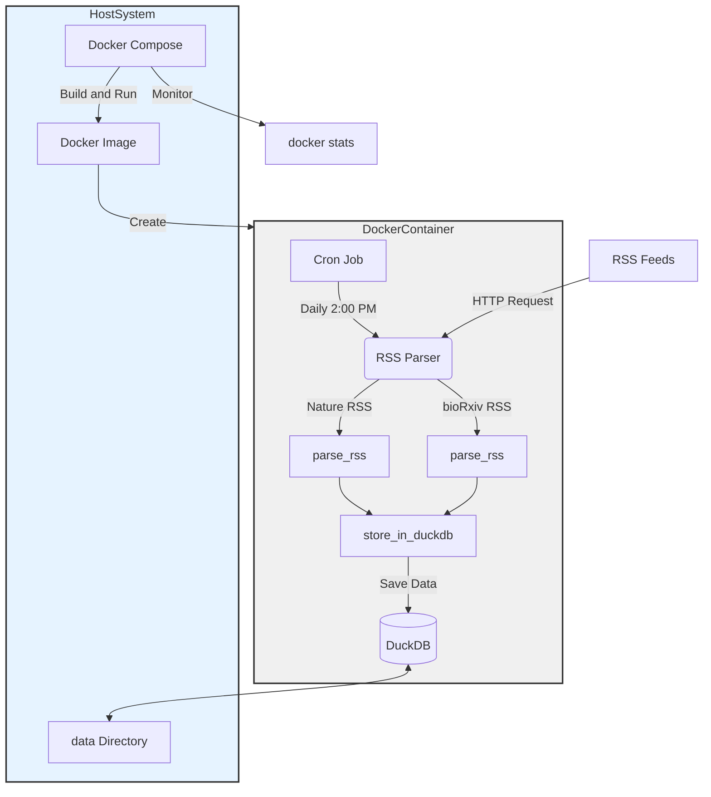

# RSS Parser for Scientific Articles

This project is a Python-based RSS parser that fetches and stores scientific articles from Nature and bioRxiv RSS feeds.

## What is RSS?

RSS (Really Simple Syndication) is a web feed that allows users and applications to access updates to websites in a standardized, computer-readable format. These feeds can, for example, allow a user to keep track of many different websites in a single news aggregator.

In the context of this project, we use RSS feeds from Nature and bioRxiv to automatically fetch the latest scientific articles and store them in a database.

## Features

- [x]Parses RSS feeds from Nature and bioRxiv
- [x]Stores article data in a DuckDB database
- [x] Updates the database daily
- [x]Handles errors and provides logging
- [ ] maker alart system for new article base on keywords

## Installation
1. Clone this repository
2. Create a conda environment using the provided `environment.yml` file:

```
conda env create -f environment.yml
```

3. Activate the environment:

```
conda activate rss_parser
```

## Usage

Run the script with:

```
python main.py
```

The script will fetch the latest articles from Nature and bioRxiv RSS feeds and store them in the database.

## Database Schema

The script creates two tables in the DuckDB database:

1. `nature_articles`
2. `biorxiv_articles`

Both tables have the following schema:

- `title`: VARCHAR
- `publish_date`: DATE
- `link`: VARCHAR
- `identifier`: VARCHAR UNIQUE
- `content`: VARCHAR
- `update_date`: DATE

## Error Handling and Logging

The script includes error handling and logging. It will log information about the parsing process, successful data storage, and any errors encountered. Check the console output for these logs.

## Date Handling

The script includes a `parse_date` function that validates the date format. If a date is invalid or missing, it will be stored as NULL in the database.

## Contributing

Feel free to fork this repository and submit pull requests with any improvements.

## License

This project is licensed under the MIT License.

## Docker System


### System Requirements

- Ubuntu 22.04.1 LTS
- NVIDIA GPU (preferably NVIDIA A100)
- CUDA Version: 12.4
- Driver Version: 550.90.07
- Rootless Docker

### Docker Usage and Installation
1. docker start(rootless docker)
    ```bash
    systemctl start docker --user
    ```

1. Build the Docker image:
   ```bash
   docker build -t rss_parser .
   ```

2. Start the container:
   ```bash
   docker compose up -d
   ```

3. The RSS parser will run automatically at 2:00 PM daily. To manually trigger the parser:
    ```bash
    docker exec rss_parser /bin/bash -c "source activate rss_parser && python /app/main.py"
    ```

4. check the docker stats
    ```bash
    docker stats rss_parser
    ```

4. Accessing the Database
    - The DuckDB database is stored in the `./data` directory on your host system. You can access it using the DuckDB CLI or any DuckDB-compatible tool.
    - description for my personal understanding
    ```yml
    volumes:  
        - ./data:/app/data
    ```
    - 호스트의 ./data 디렉토리 (현재 디렉토리의 data 폴더)가 컨테이너 내부의 /app/data 디렉토리에 마운트
        - 컨테이너 내부에서 /app/data에 쓰여진 모든 데이터는 호스트의 ./data 폴더에 반영
        - 반대로 호스트의 ./data 폴더에 추가된 모든 파일은 컨테이너 내부의 /app/data에서 접근 가능

5. Logs
    - To view the logs:
    ```bash
    docker compose logs rss_parser
    ```

6. Stopping the Container
    - To stop the container:
    ```bash
    docker compose down
    ```

7. Development
    - For development purposes, you can access the running container:
    ```bash
    docker exec -it rss_parser /bin/bash
    ```
## Contributing

Feel free to fork this repository and submit pull requests with any improvements.

## License

This project is licensed under the MIT License.