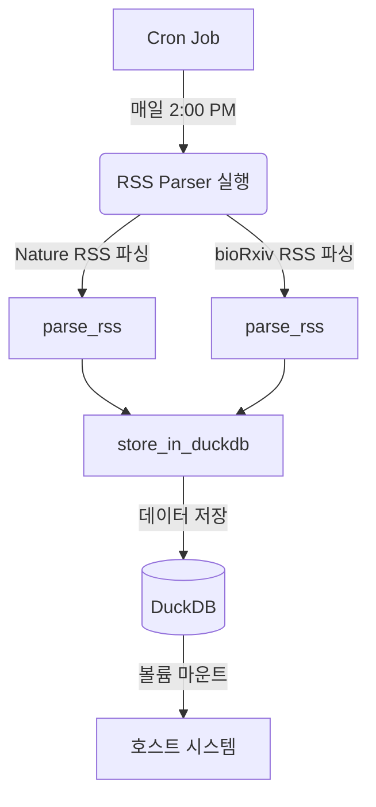

# RSS Parser for Scientific Articles

This project is a Python-based RSS parser that fetches and stores scientific articles from Nature and bioRxiv RSS feeds.

## What is RSS?

RSS (Really Simple Syndication) is a web feed that allows users and applications to access updates to websites in a standardized, computer-readable format. These feeds can, for example, allow a user to keep track of many different websites in a single news aggregator.

In the context of this project, we use RSS feeds from Nature and bioRxiv to automatically fetch the latest scientific articles and store them in a database.

## Features

- Parses RSS feeds from Nature and bioRxiv
- Stores article data in a DuckDB database
- [ ] Updates the database daily
- Handles errors and provides logging

## Installation
1. Clone this repository
2. Create a conda environment using the provided `environment.yml` file:

```
conda env create -f environment.yml
```

3. Activate the environment:

```
conda activate rss_parser
```

## Usage

Run the script with:

```
python main.py
```

The script will fetch the latest articles from Nature and bioRxiv RSS feeds and store them in the database.

## Database Schema

The script creates two tables in the DuckDB database:

1. `nature_articles`
2. `biorxiv_articles`

Both tables have the following schema:

- `title`: VARCHAR
- `publish_date`: DATE
- `link`: VARCHAR
- `identifier`: VARCHAR UNIQUE
- `content`: VARCHAR
- `update_date`: DATE

## Error Handling and Logging

The script includes error handling and logging. It will log information about the parsing process, successful data storage, and any errors encountered. Check the console output for these logs.

## Date Handling

The script includes a `parse_date` function that validates the date format. If a date is invalid or missing, it will be stored as NULL in the database.

## Contributing

Feel free to fork this repository and submit pull requests with any improvements.

## License

This project is licensed under the MIT License.

## Docker System
